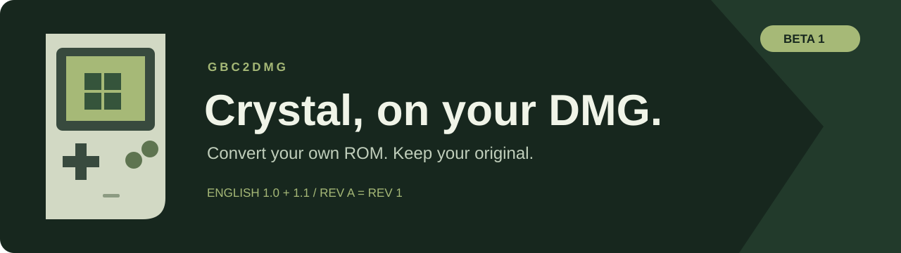

# GBC2DMG

Convert supported Game Boy Color ROMs for the original Game Boy. Bring your own ROM; GBC2DMG identifies it, applies the matching port, and verifies the result.

**[Download the Windows beta](https://github.com/ItsJustBshawn/GBC2DMG/releases/tag/v0.4-beta.1)** · [Report a problem](https://github.com/ItsJustBshawn/GBC2DMG/issues) · [Test results](docs/TESTING.md)

## Supported games

| Game | Version | Other names | Status |
| --- | --- | --- | --- |
| Pokémon Crystal, English (USA/Europe) | 1.0 | Original, Rev 0 | Beta |
| Pokémon Crystal, English (USA/Europe) | 1.1 | Rev 1, Rev A | Beta |

Rev A and Rev 1 are the same revision. The filename does not determine support: the complete ROM must match a SHA-256 in [catalog.json](catalog.json). The 1.1 conversion keeps the 1.1 changes.

This is a collection of tested, game-specific ports. It cannot convert an arbitrary GBC game. New games and revisions are added only after maintainer review and testing.

## Use it

1. Download and extract `GBC2DMG-v0.4-beta.1-Windows.zip`. Keep the whole folder together.
2. Open `GBC2DMG.exe` and choose your original ROM.
3. Check the detected version, then choose **Convert to DMG** and a new filename.
4. Test the new `.gb` file in a DMG-mode emulator or on your flash cartridge.

The original stays untouched. Existing files are never overwritten. Conversion runs locally, without uploads or an internet connection. No ROM is included.

## Which version do I have?

Choose the ROM in the app. It shows the exact supported version, aliases, header checksums and SHA-256. **Copy version report** gives you a small report to attach to a bug report. Unknown files remain unsupported even if their header says revision 0 or 1.

From source, you can also run:

```sh
python identify_rom.py "your-game.gbc"
python identify_rom.py "your-game.gbc" --json
```

## Before you play

- This is a beta. Keep a separate copy of your original ROM and saves.
- The clock advances during play and is saved. It pauses while the Game Boy is off.
- The output uses MBC5 with 128 KB save RAM. Your emulator or cartridge must support that configuration.
- Graphics have been adapted for the DMG's smaller video memory. Four Suicune title poses animate; the intro uses blank transitions while replacing graphics.
- The latest builds passed emulator checks. Physical DMG/EZ-Flash testing, a full playthrough, link functions and every battle effect are still outstanding.

See [testing and known limits](docs/TESTING.md). Please include the version report, hardware/emulator and steps to reproduce when reporting a problem. Do not attach ROMs.

## Run or build from source

Python 3.11 or newer with Tk is required. On Windows, the standard Python installer includes Tk.

```sh
python app.py
python -m unittest discover -s tests -v
python tools/check_catalog.py
```

To build the Windows app on Windows:

```sh
python -m venv .venv
.venv\Scripts\python -m pip install -r requirements-build.txt
.venv\Scripts\python -m PyInstaller --clean --noconfirm GBC2DMG.spec
```

The app will be in `dist/GBC2DMG`. The recipes shipped here are sufficient to reproduce the converted outputs from matching inputs. `build_recipe.py` is a maintainer tool for packaging an already-built and tested port, not an automatic port generator.

## Downloads and scans

Release assets include SHA-256 checksums and a local Microsoft Defender scan report. A scan records what that scanner found at that time; it is not a guarantee. The Windows build is unsigned. You can inspect the source or build it yourself. See [security notes](docs/SECURITY.md).

## Credits

The Crystal port was developed against [pret/pokecrystal](https://github.com/pret/pokecrystal), built with [RGBDS](https://github.com/gbdev/rgbds), and tested with [SameBoy](https://github.com/LIJI32/SameBoy). Thanks to their contributors and the Game Boy development community.

GBC2DMG's application code is MIT licensed; see [LICENSE](LICENSE). Pokémon and its game data belong to their respective owners. This project is unofficial and is not affiliated with Nintendo, Game Freak or The Pokémon Company.
